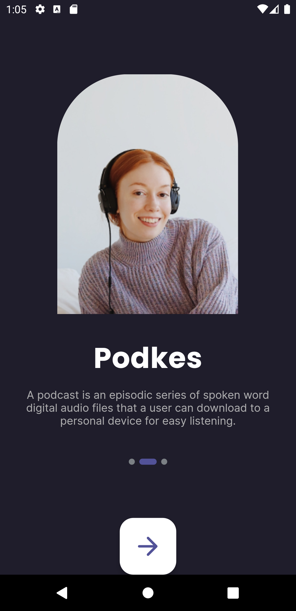
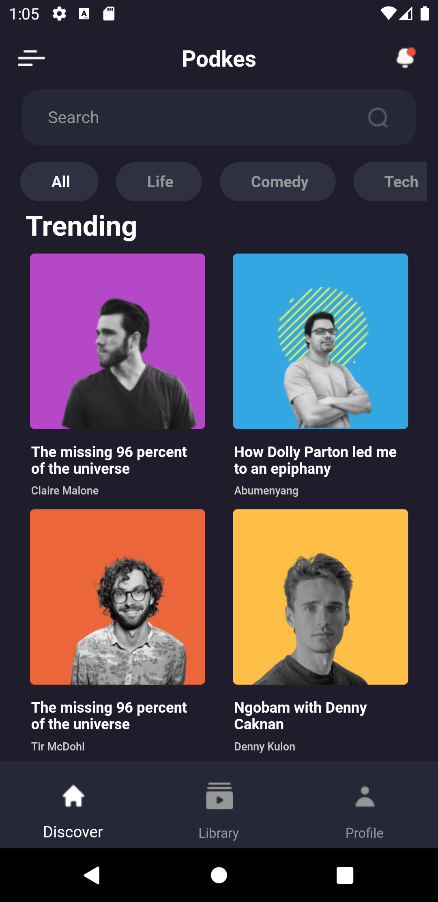
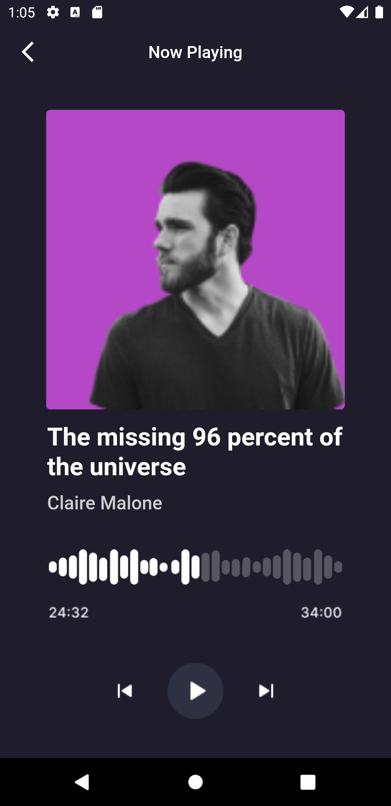

# podkes

A new Flutter Mobile Design Project called Podkes.

### Description

This Flutter project is a podcast application, focusing solely on the user interface (UI) design. The app provides a visually appealing and functional UI for exploring and listening to podcasts. It includes screens for the splash screen, home screen with category navigation, and play screen for podcast playback.

## Screenshots

| Splash Screen | Home Screen | Play Screen |
|--------------|--------------|--------------|
|  |  |  |

## Features
- **Splash Screen:** An introductory screen with the project title, a project image, and a next button to navigate to the home screen.

- **Home Screen:** Displays podcasts in different categories. Users can navigate through categories and explore various podcasts.

- **Play Screen:** Allows users to play podcasts with controls for skipping back, playing/pausing, and skipping forward. It includes information about the podcast being played.

### Installation

**Clone the repository:**

[https://github.com/merveaa/Podkes](https://github.com/merveaa/Podkes.git)

**Install dependencies:**

```bash
  flutter pub get
```

**Run the app:**

```bash
  flutter run
```
